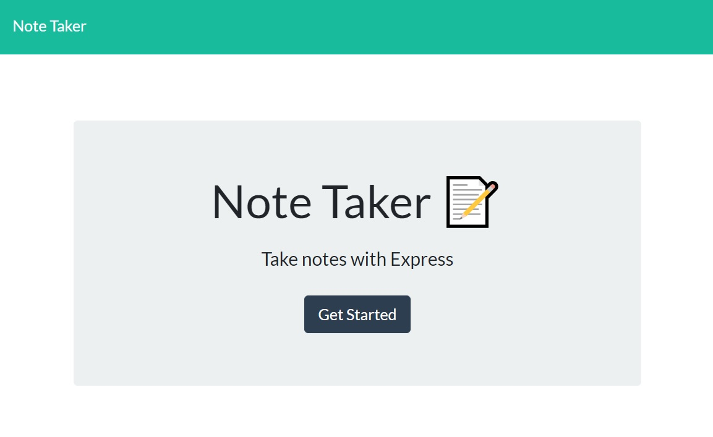

 

  <h1 align="center">Note Taker</h1>

## Description 

This handy little app can be used to take notes and it will save them on the server for later viewing.

## Table of Contents

* [Usage](#usage)
* [Contributing](#contributing)
* [Tests](#tests)
* [License](#license)
* [Questions](#questions)
* [Links](#links)

## Usage 

1. Visit the site [HERE](https://desolate-taiga-67985.herokuapp.com/).
2. Click the GET STARTED button.
3. Enter your note title and description on the NOTE TITLE and NOTE TEXT areas.
4. A little save icon will appear top right, click that and it is saved!
* You can also delete notes by clicking the little trash icon next to the note.
  

## Contributing

No contributions at this time please, but your are free to use this code in your own project given the license listed below.

## Tests

I welcome any tests or suggestions to better this project in the future.

## License

This project is covered under the MIT license.

## Questions

I can be contacted via email or on github at:

* E-mail: johntaylorwoodland@gmail.com
* Github: https://github.com/jondagamkd/

## Links

The site can be reached [HERE](https://desolate-taiga-67985.herokuapp.com/)

